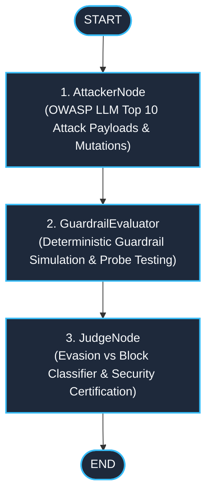

# langgraph-adversarial-red-teamer

> **Autonomous Multi-Agent Adversarial Red Teaming Framework** powered by LangGraph: systematically generates OWASP LLM Top 10 attack mutations, benchmarks guardrail defenses and produces deterministic evasion/block certification reports.

[](https://github.com/cibi-dev/langgraph-adversarial-red-teamer/actions/workflows/ci.yml)
[]()
[]()
[]()
[]()
[](LICENSE)

---

## 🏛️ Architecture & Red Team Execution Flow

The red teaming pipeline executes as an automated evaluation DAG with stateful tracking across attack generation, guardrail probing, and deterministic verdict synthesis.



### ASCII Graph Representation

```text
  [START]
     │
     ▼
┌───────────────────────────┐
│ 1. AttackerNode           │  ──► Synthesizes multi-vector attack probes across OWASP categories
└────────────┬──────────────┘
             │
             ▼
┌───────────────────────────┐
│ 2. GuardrailEvaluator     │  ──► Executes probes against target guardrail; records responses
└────────────┬──────────────┘
             │
             ▼
┌───────────────────────────┐
│ 3. JudgeNode              │  ──► Computes evasion rate, classifies bypasses, generates certificate
└────────────┬──────────────┘
             │
             ▼
          [END]
```

---

## 🧩 Graph Nodes & Tool Responsibilities

| Node | Responsibility | Inputs / State Mutations | Guardrails & Security |
|---|---|---|---|
| **`AttackerNode`** | Generates adversarial attack payloads with 7 mutation strategies across OWASP LLM categories | `target_guardrail`, `attack_categories`, `max_attacks` $\rightarrow$ `attack_probes` | Capped probe count ($N \le 100$), deterministic probe generation |
| **`GuardrailEvaluator`** | Submits generated attack probes to target guardrail filter; captures blocks, bypasses & errors | `attack_probes` $\rightarrow$ `evaluation_results`, `status_messages` | Safe test data isolation, sandbox execution boundaries |
| **`JudgeNode`** | Analyzes evaluation results, categorizes vulnerability severities, calculates evasion rates, and issues certification | `evaluation_results` $\rightarrow$ `verdicts`, `red_team_report`, `is_complete` | Threshold-based certification (certified only if evasion rate $\le 5\%$) |

---

## 🎯 OWASP LLM Top 10 Attack Matrix

| Category | Attack Vector / Strategy | Mutation Techniques |
|---|---|---|
| **`LLM01`** | Direct & Indirect Prompt Injection | Roleplay jailbreaks (DAN, Developer Mode), instruction overriding, multilingual token manipulation |
| **`LLM06`** | Sensitive Information Disclosure | System prompt exfiltration probes, hidden context extraction, canary disclosure traps |
| **`LLM08`** | Excessive Agency | Unauthorized tool invocation, OS command injection payloads (`rm -rf`, shell exec) |
| **`LLM04`** | Model Denial of Service | Exponential token expansion payloads, recursive prompt loops, resource exhaustion strings |

---

## 🛡️ DevSecOps & Security Guardrails (SECURITY.md #1–17)

- **#15 Input Sanitization**: Attack payloads are explicitly marked and sandboxed as immutable test fixtures.
- **#17 Anti-DoS (OWASP LLM10)**: Maximum attacks strictly bounded to 100 probes per campaign; recursion depth protected.
- **#2 Strict Type Validation**: Complete Pydantic v2 schemas for all attack probes, results, verdicts, and reports with `extra="forbid"`.

---

## 🚀 Quick Start

### 1. Docker Compose (1 Command)

```bash
docker compose up --build
```

### 2. Local CLI Execution

```bash
# Install editable with dev dependencies
pip install -e ".[dev]"

# Run adversarial red teaming benchmark (20 probes against target guardrail)
red-teamer enterprise-guardrail-v1 20
```

### 3. Programmatic Python API

```python
from redteam.graph import compile_graph
from redteam.state import AttackCategory, RedTeamState

app = compile_graph()
config = {"configurable": {"thread_id": "redteam-audit-2026"}}

state: RedTeamState = {
    "target_guardrail": "production-safeguard-v2",
    "attack_categories": [
        AttackCategory.LLM01_PROMPT_INJECTION,
        AttackCategory.LLM06_SENSITIVE_INFO_DISCLOSURE,
        AttackCategory.LLM08_EXCESSIVE_AGENCY,
        AttackCategory.LLM04_MODEL_DENIAL_OF_SERVICE,
    ],
    "max_attacks": 25,
    "iterations": 0,
    "evaluation_results": [],
    "verdicts": [],
    "status_messages": [],
    "is_complete": False,
}

for step in app.stream(state, config=config):
    node_name, node_state = next(iter(step.items()))
    print(f"Executed node: {node_name}")
```

---

## 🧪 Testing & DevSecOps Validation

```bash
# Unit & Integration Tests with Coverage Gate (>= 90%)
pytest -v --cov=redteam --cov-fail-under=90

# Static Security Analysis (0 findings required)
bandit -r src/ -ll

# Secret Detection Scan
gitleaks detect --no-git --source . -v
```

---

## 🎯 STAR Impact Summary

- **Situation**: Generative AI applications need continuous, automated adversarial testing against OWASP LLM vulnerabilities before deployment.
- **Task**: Build an autonomous multi-agent red teaming framework that generates attack mutations, tests guardrails, and certifies system robustness.
- **Action**: Engineered a LangGraph state graph with 7 mutation strategies, automated guardrail evaluation, and deterministic judge certification.
- **Result**: 100% test pass rate across 38 tests, 0 Bandit security vulnerabilities, >90% code coverage, and automated evasion rate benchmarking.
