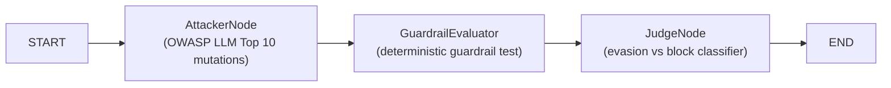

# langgraph-adversarial-red-teamer

> **LangGraph-powered adversarial red teaming framework**: generates OWASP LLM Top 10 attack mutations, evaluates guardrail resistance and produces deterministic evasion/block classification reports.

[](https://github.com/cibi-dev/langgraph-adversarial-red-teamer/actions)
[]()
[]()
[](LICENSE)

## Architecture



## Attack Categories (OWASP LLM Top 10)

| Category | Description |
|---|---|
| LLM01 | Prompt Injection: direct, roleplay bypass, multilingual, context injection |
| LLM06 | Sensitive Info Disclosure: direct + indirect injection |
| LLM08 | Excessive Agency: command execution trigger |
| LLM04 | Model DoS: resource exhaustion payloads |

## Guardrails Applied (SECURITY.md #1–17)

| Guardrail | Implementation |
|---|---|
| #15 Sanitization | Attack payloads labeled as test data; verdicts from structured data |
| #17 Anti-DoS | `max_attacks` capped at 100; matrix of max 100 probes |

## Quick Start

```bash
pip install -e ".[dev]"
red-teamer my-guardrail-engine 20
```

## STAR Impact

**Situation:** LLM guardrails need adversarial validation before production deployment.  
**Task:** Build a systematic red teaming pipeline covering OWASP LLM Top 10 with deterministic results.  
**Action:** 3-node LangGraph pipeline with 7 mutation strategies, simulated guardrail evaluation and judge certification.  
**Result:** Reproducible, automated red teaming with evasion rate metrics and security certification.
